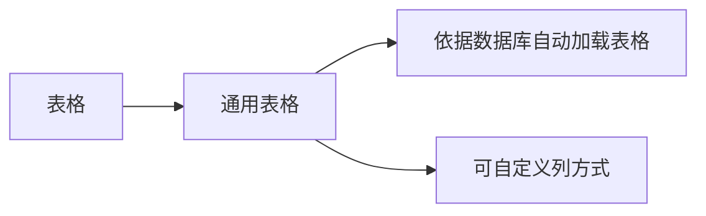
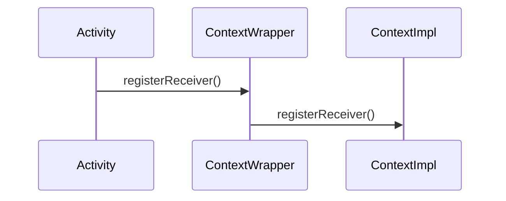

## 概述
 定义一种通用表格的组件

## 练习步骤

```mermaid

graph LR
 a[表格]
 b[通用表格]
 c[依据数据库自动加载表格]
 d[可自定义列方式]
 a-->b
 b-->c
 b-->d

```

## 流程图举例说明

```mermaid
sequenceDiagram
    Activity ->> ContextWrapper : registerReceiver()
    ContextWrapper ->> ContextImpl : registerReceiver()


```

