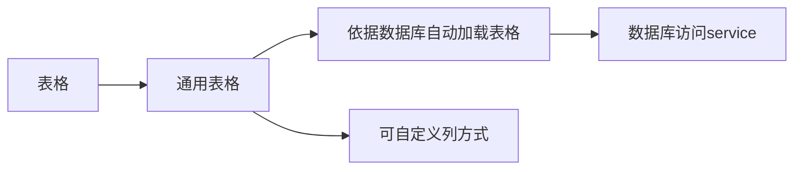
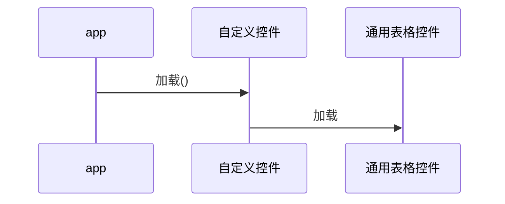

## 概述
 定义一种通用表格的组件

## 练习步骤

```mermaid

graph LR
 a[表格]
 b[通用表格]
 c[依据数据库自动加载表格]
 c.1[数据库访问service]
 d[可自定义列方式]
 a-->b
 b-->c
 c-->c.1
 b-->d

```

## 流程图举例说明

```mermaid
sequenceDiagram
    app ->> 自定义控件 : 加载()
    自定义控件 ->> 通用表格控件 : 加载
    


```

