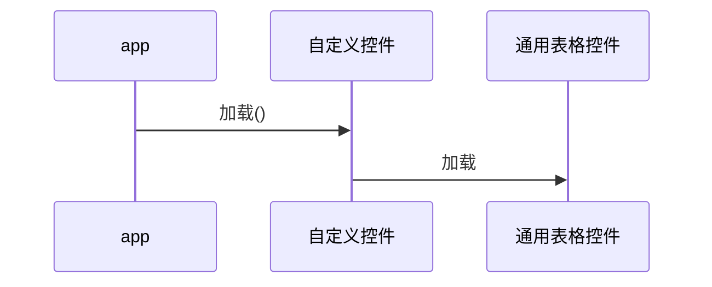

## 概述
 定义一种通用表格的组件

## 练习步骤


```nomnoml

[baseTable|
[gui]
[memory]
[db]
]
```


```nomnoml
[<frame>Decorator pattern|
  [<abstract>Component||+ operation()]
  [Client] depends --> [Component]
  [Decorator|- next: Component]
  [Decorator] decorates -- [ConcreteComponent]
  [Component] <:- [Decorator]
  [Component] <:- [ConcreteComponent]
]
```


## 流程图举例说明


