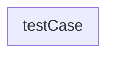

##
  提供组件测试基本功能

##概述

1、  提供测试页面
2、  提供测试页面能力

新增一个测试用例：
    测试参数输入

## 
```nomnoml
[测试用例] ->[测试数据]
 [测试用例 ]->[代码模板]
 [测试用例] ->[预览页面]
 [测试数据]->[被测试组件]
 

           
```



```mermaid
graph TD
 subgraph testCase
   
 end 


```
