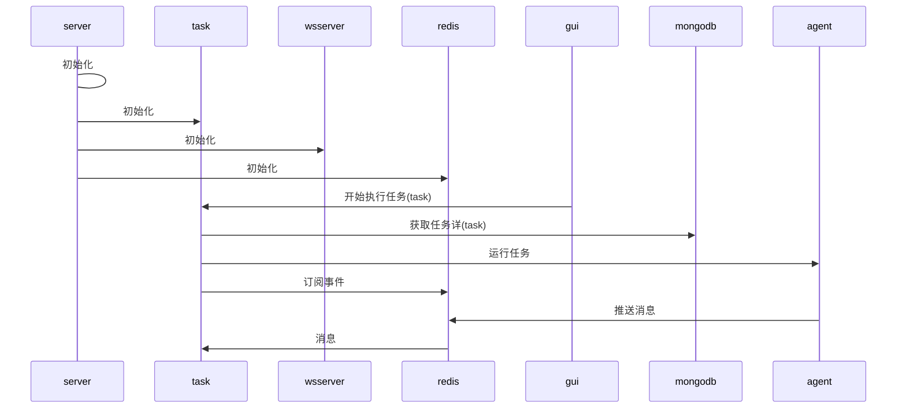

## 目标

## 主要功能
```
  nodejs  提供mongodb api
          提供wsserver给前端GUI显示
          提供task api 给前端执行任务   
```

## 流程

```nomnoml

[server] ->  [redis]
  [server] ->[httpserver
  ]
  [httpserver]-> [task]
      [httpserver]->[mongodb]
  [server] ->[wsserver]
```





## 参考
https://www.cnblogs.com/xuzhiwei/p/4569315.html
https://github.com/MicrosoftArchive/redis/releases
